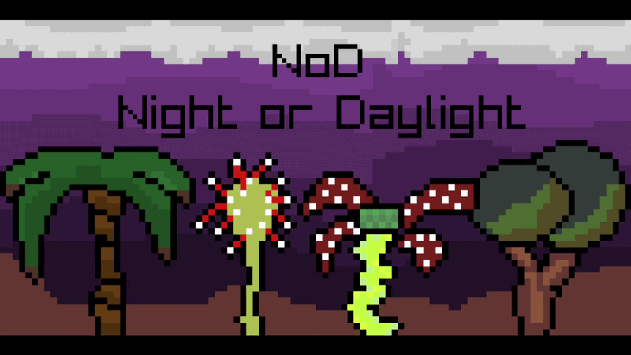
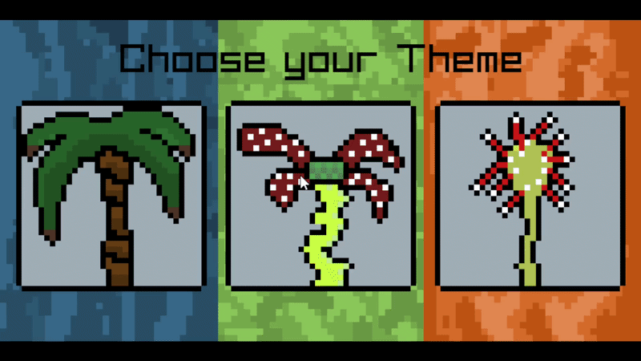

# NoD - Night or Daylight Clock

NoD is a small C++/raylib desktop clock that changes its visuals
and audio based on the current local PC time and choosen Theme.

## Features

- Automatic Morning / Daylight / Night switching
- Beach, Forest and Vulcan themes
- Animated pixel-art Themes
- Different audio played for the themes
- Animated startscreen, selectionscreen
- Buttons with sound effects
- Digital clock based on the local PC time

## Preview

### Startscreen

### Theme

## Version 2.0

Version 2.0 additions:
- Multiple selectable themes
- Animated Startscreen, Theme selection and Themes
- New Forest and Vulcan themes
- Theme based audio
- clickable buttons (HomeButton and ThemeButtons)
- Button sound effects

## Built With

- C++
- raylib
- Aseprite